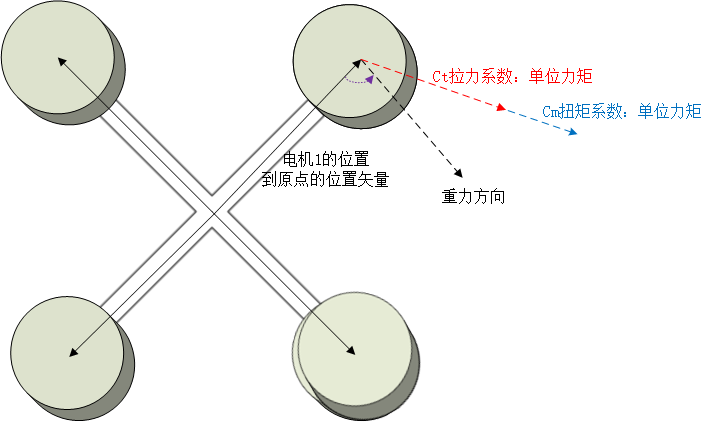
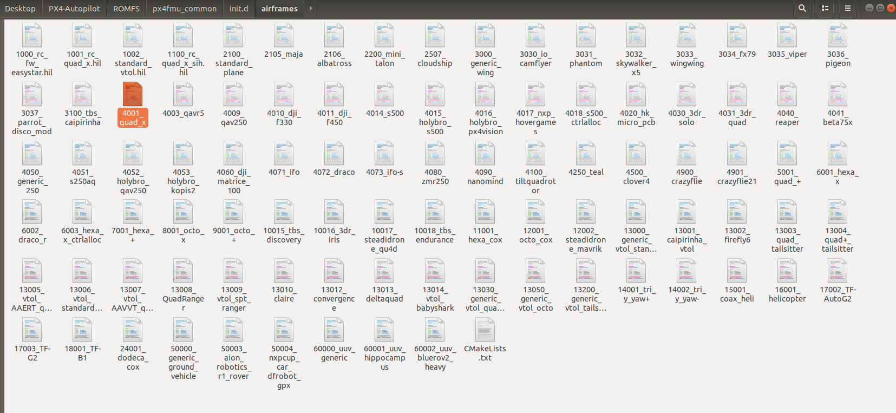

[toc]

# PX4 PWM的两种输出形式

1. 在PX4中，如果有io芯片，且使用了io作为输出PWM的设备，则fmu将mixer传输给io，io进行混控计算并输出PWM，将pwm结果传递回fmu，此时无app订阅acuator_outpus，就是给人看的；在`~/PX4-Autopilot/src/drivers/px4io/px4io.cpp`中的

```c++
/* fetch PWM outputs from IO */
io_publish_pwm_outputs();
```

​				在px4iofirmware和pwm_out中，都使用函数**up_pwm_servo_set**进行PWM输出

```c++
bool PWMOut::updateOutputs(bool stop_motors, uint16_t outputs[MAX_ACTUATORS],
			   unsigned num_outputs, unsigned num_control_groups_updated)
{
	if (_test_mode) {
		return false;
	}

	/* output to the servos */
	if (_pwm_initialized) {
		for (size_t i = 0; i < math::min(_num_outputs, num_outputs); i++) {
			up_pwm_servo_set(_output_base + i, outputs[i]);
		}
	}

	/* Trigger all timer's channels in Oneshot mode to fire
	 * the oneshots with updated values.
	 */
	if (num_control_groups_updated > 0) {
		up_pwm_update(); // TODO: review for multi
	}

	return true;
}
```

2.  如果有io芯片但没作为PWM输出，或者无io芯片，则在fmu的PWM输出设备上进行PWM输出；在`mixer_module.cpp`文件下；该处的_interface可以指PWM，也可以是IO的PWM，也可以是UAVCAN的。通过`_interface.updateOutputs`函数最终调用底层函数`io_timer_set_ccr(channel, value)`；

```c++
/* now return the outputs to the driver */
if (_interface.updateOutputs(stop_motors, _current_output_value, mixed_num_outputs, n_updates)) {
    actuator_outputs_s actuator_outputs{};
    setAndPublishActuatorOutputs(mixed_num_outputs, actuator_outputs);

    publishMixerStatus(actuator_outputs);
    updateLatencyPerfCounter(actuator_outputs);
}
```

   


# Python自动化脚本生成mixer

本文档用于描述PX4中自动生成mixer的算法部分，Python脚本``px_generate_mixers.py``位于``..\px4_autopilot_V1.11\src\lib\mixer\MultirotorMixer\geometries\tools``中；主函数的前面部分为解析``.toml``文件的，感兴趣的可以研究下。

## toml文件

以通用四旋翼的``.toml``文件为例，介绍各个字段的含义；``.toml``文件位于``..\px4_autopilot_V1.11\src\lib\mixer\MultirotorMixer\geometries``文件夹下。


```toml
# Generic Quadcopter in X configuration

[info]
key = "4x"
description = "Generic Quadcopter in X configuration"

[rotor_default]
direction = "CW" # clockwise 表示顺时针
axis      = [0.0, 0.0, -1.0] # 表示电机的安装方向，NED坐标系下向下为正，电机朝上，所以是-1.0
Ct        = 1.0  # 表示无量纲的拉力系数（thrust）
Cm        = 0.05 # 表示无量纲的扭矩系数（torque）

[[rotors]]
name      = "front_right" 	# 前右的电机，1号电机
position  = [0.707107, 0.707107, 0.0]
direction = "CCW" # counterclockwise 表示逆时针

[[rotors]]
name      = "rear_left"		# 后左的电机，2号电机
position  = [-0.707107, -0.707107, 0.0]
direction = "CCW"

[[rotors]]
name     = "front_left"		# 前左的电机，3号电机
position = [0.707107, -0.707107, 0.0]

[[rotors]]
name     = "rear_right"		# 后右的电机，4号电机
position = [-0.707107, 0.707107, 0.0]

```

# 根据机型自动生成混控器

**函数功能**：根据机型的几何形状构建torque matrix和thrust matrix；其中：

**$A$**是一个$6 \times N$的矩阵，$N$表示电机的数目；每一列的6个数表示每个电机所产生的扭矩和推力；

**$B$**是一个$N \times 6$的矩阵，$N$表示电机的数目；每一列是应用于伺服机构的指令，得到滚转力矩、俯仰力矩、偏航力矩、x方向推力、y方向推力、z方向推力；（坐标系：前右下）

```python
def geometry_to_mix(geometry):
	
    '''
    Compute combined torque & thrust matrix A and mix matrix B from geometry dictionnary

    A is a 6xN matrix where N is the number of rotors
    Each column is the torque and thrust generated by one rotor

    B is a Nx6 matrix where N is the number of rotors
    Each column is the command to apply to the servos to get
    roll torque, pitch torque, yaw torque, x thrust, y thrust, z thrust
    '''
    # Combined torque & thrust matrix
    # At: A thrust
    # Am: A moment
    At = geometry_to_thrust_matrix(geometry)
    Am = geometry_to_torque_matrix(geometry)
    # 对于两个大小相回的数组a和b,即a是m*n, b也是m'n
    # 那么函数np.vstack(ab)：保持列不变，进行进接。拼接之后大小为2m*n
    A = np.vstack([Am, At])

    # Mix matrix computed as pseudoinverse of A
    # 求矩阵A的逆
    B = np.linalg.pinv(A)

    return A, B

```

## 计算推力矩阵**$At$**

**函数功能**：从几何字典计算推力矩阵**$At$**，**$At$**为$3 \times N$矩阵，其中$N$为电机的数量，每一列是一个电机产生的推力；

```python
def geometry_to_thrust_matrix(geometry):
    '''
    Compute thrust matrix At from geometry dictionnary
    At is a 3xN matrix where N is the number of rotors
    Each column is the thrust generated by one rotor
    '''
    At = thrust_matrix(axis=np.array([rotor['axis'] for rotor in geometry['rotors']]),
                       Ct=np.array([[rotor['Ct']] for rotor in geometry['rotors']])).T

    return At

##
def thrust_matrix(axis, Ct):
    '''
    Compute thrust generated by rotors
    '''
    # Normalize rotor axis
    # np.linalg.norm()用于求范数，linalg本意为linear(线性) + algebra(代数)，norm则表示范数。
    ax = axis / np.linalg.norm(axis, axis=1)[:, np.newaxis]
    thrust = Ct * ax
    return thrust

```

其中：``ax = axis / np.linalg.norm(axis, axis=1)[:, np.newaxis]``其实就是$thrust = Ct \times axis$；因为$axis = [0, 0, -1]$；所以，thrust只有向上的量，水平方向的分力为零。改变电机的安装方向，即：$axis$，thrust可以分解得到三轴方向的分量。

## 计算力矩矩阵**$Am$**

**函数功能**：根据机型计算扭矩矩阵$Am$和$Bm$，$Am$是一个$3 \times N$矩阵；其中：$N$是电机的数量，每一列是每个电机产生的转矩；

```python
def geometry_to_torque_matrix(geometry):
    '''
    Compute torque matrix Am and Bm from geometry dictionnary
    Am is a 3xN matrix where N is the number of rotors
    Each column is the torque generated by one rotor
    '''
    Am = torque_matrix(center=np.array([rotor['position'] for rotor in geometry['rotors']]),
                       axis=np.array([rotor['axis'] for rotor in geometry['rotors']]),
                       dirs=np.array([[1.0 if rotor['direction'] == 'CCW' else -1.0]
                                      for rotor in geometry['rotors']]),
                       Ct=np.array([[rotor['Ct']] for rotor in geometry['rotors']]),
                       Cm=np.array([[rotor['Cm']] for rotor in geometry['rotors']])).T
    return Am

##
def torque_matrix(center, axis, dirs, Ct, Cm):
    '''
    Compute torque generated by rotors
    '''
    # normalize rotor axis
    ax = axis / np.linalg.norm(axis, axis=1)[:, np.newaxis]
    torque = Ct * np.cross(center, ax) - Cm * ax * dirs
    return torque

```

其中：``torque = Ct * np.cross(center, ax) - Cm * ax * dirs``;

力矩 = 拉力系数 *  cross(位置矢量， 电机安装方向) - 扭矩系数 * 电机安装方向 * 电机旋转方向；

该等式前部分由右手定则确定方向（这部分应该是thrust沿着重心到1号电机圆心方向的分量所产生的的扭矩），后部分电机旋转方向为逆时针的话，dirs为-1（这部分应该是由于电机的旋转而产生的扭矩）；由于计算过程中，均是归一化的数值，因此所产生的扭矩也应该是单位扭矩；



## 归一化混控矩阵**$B$**

```python
def normalize_mix_px4(B):
    '''
    Normalize mix for PX4
    This is for compatibility only and should ideally not be used
    '''
    B_norm = np.linalg.norm(B, axis=0)
    B_max = np.abs(B).max(axis=0)
    B_sum = np.sum(B, axis=0)

    # Same scale on roll and pitch
    B_norm[0] = max(B_norm[0], B_norm[1]) / np.sqrt(B.shape[0] / 2.0)
    B_norm[1] = B_norm[0]

    # Scale yaw separately
    B_norm[2] = B_max[2]

    # Same scale on x, y
    B_norm[3] = max(B_max[3], B_max[4])
    B_norm[4] = B_norm[3]

    # Scale z thrust separately
    B_norm[5] = - B_sum[5] / np.count_nonzero(B[:,5])

    # Normalize
    B_norm[np.abs(B_norm) < 1e-3] = 1
    B_px = (B / B_norm)

    return B_px
```

$$
\left[
\begin{matrix}
thrust_\_x 		\\
thrust_\_y		\\
thrust_\_z 		\\
torque_\_x	 	\\
torque_\_y	 	\\
torque_\_z	 	\\
\end{matrix}
\right] 
= 
A
\left[
\begin{matrix}
\omega_1^2 		\\
\omega_2^2 		\\
\vdots			\\
\omega_{n-1}^2	\\
\omega_n^2		\\
\end{matrix}
\right]
$$

混控矩阵**$B$**：
$$
B = A^{-1}
$$

# Mixer的启动

## Mixer语法

不同的机型使用的Mixer不同。所有的Mixer文件都在` ~firmware\ROMFS\px4fmu_common\mixers` 路径下。以最简单的X型四旋翼`quad_x.main.mix`为例。

```c
R: 4x

AUX1 Passthrough
M: 1
S: 3 5  10000  10000      0 -10000  10000

AUX2 Passthrough
M: 1
S: 3 6  10000  10000      0 -10000  10000

Failsafe outputs
The following outputs are set to their disarmed value
during normal operation and to their failsafe falue in case
of flight termination.
Z:
Z:

```

PX4有16路PWM输出，其中MAIN主控输出8路（电机或舵机控制，多旋翼，固定翼），AUX辅控输出8路（起落架、相机、云台，垂起）。主控和辅控必须分开。主控文件必须以**`XXXX.main.mix`**命名，辅控文件必须以**`XXXX.aux.mix`**命名。

Mixer通过文本文件定义；以单个大写字母加一个冒号开始的行是有效的，其它的行则会被忽略。每个混控器按照它们在Mixer文件中出现的顺序对应到输出$1 \sim x$。

一个Mixer定义通常具有如下形式：`<tag>: <mixer arguments>`

1) Null Mixer

   Z: 空混控器不接受控制输入并产生单个作动器输出，其输出值恒为零。空混控器的典型用法是在一组定义作动器特定输出模式的混控器组中占位。

2) Multirotor Mixer

   R: <geometry> <roll scale> <pitch scale> <yaw scale> <idlespeed>

   支持的几何结构包括但不限于：

   - 4x - quadrotor in X configuration
   - 4+ - quadrotor in + configuration
   - 6x - hexacopter in X configuration
   - 6+ - hexacopter in + configuration
   - 8x - octocopter in X configuration
   - 8+ - octocopter in + configuration
   - <roll scale> = $10000 \times kr$，kr为滚转响应的缩放因子
   - <pitch scale> = $10000 \times kp$，kp为俯仰响应的缩放因子
   - <yaw scale> = $10000 \times ky$，ky为偏航响应的缩放因子
   - <idlespeed> = $10000 \times \delta_{idle}$，$\delta_{idle}$为怠速油门，一般置0

3) Simple Mixer

   - M: <control count>

   - O: <-ve scale> <+ve scale> <offset> <lower limit> <upper limit>

   - S: <group> <index> <-ve scale> <+ve scale> <offset> <lower limit> <upper limit>

   - <control count>表示输入个数。“M”表示所有输入在经过处理后相加。<group>是数组序号。<index>是数组里的通道号。<-ve scale> <+ve scale>是比例。<offset>是偏置，输入映射后与此项相加。<lower limit> <upper limit>是限幅。

   - O: 是S: 的特例，不算在<control count>里，直接输出<lower limit> <upper limit>限幅后的<offset>。S: 必须在O: 后面。

     e.g.: S: 3 5  8000 8000  0  -10000 10000 表示Control Group #3的第5个通道RC aux1作为输入，乘以比例8000（0.8是响应的缩放因子），加上偏置0，然后[-10000, 10000]限幅。

   - S: 3 5  -8000 8000  0  -10000 10000 表示Control Group #3的第5个通道RC aux1作为输入，若其值大于0，则乘以比例8000，否则乘以比例-8000，然后加上偏置0，再[-10000, 10000]限幅。

## 加载mixer文件

在`~firmware\ROMFS\px4fmu _common\init.d\rcS`文件中，rcs会调用`~firmware\build\px4_fmu-v5_default\etc\init.d\`下的`rc.autostart`文件。

```c
#
# Set parameters and env variables for selected AUTOSTART.
#
if ! param compare SYS_AUTOSTART 0
    then
    . ${R}etc/init.d/rc.autostart
fi

```

在`rc.autostart`中，根据参数`SYS_AUTOSTART`调用相应的机型文件。如下图，若SYS_AUTOSTART等于4001，则调用机型文件`4001_quad_x`。相关机型文件的路径为`~firmware\ROMFS\px4fmu_common\init.d\airframes`.

为了判断参数SYS_AUTOSTART，机型文件必须以数字开头，且PX4中已定义，SYS_AUTOSTART的范围为$[0, 99999]$。

```c
if param compare SYS_AUTOSTART 4001
then
set AIRFRAME 4001_quad_x
fi

```



# 信号输出

在信号输出的最后阶段我们就有两种情况：

1. 飞控用协处理器px4 io输出最终控制信号，多旋翼用该模式（200Hz）。
2. 飞控FMU直接输出最终控制信号，固定翼用该模式（50Hz）。

首先需要说明的是在lib里的程序都不会属于应用程序，所以说这么一说，大家自然就很清楚了，必然是`pwm_out`的程序是作为进程执行，而`mixer`和`mixer_module`中的类和函数之类的则在pwm_out中被定义被调用。

1. `src/lib/mixer`文件中有各种mixer的定义和程序实现；PX4中混控器不仅通过效率矩阵将控制力和控制力矩分配到各个电机，而且还包含了输出抗饱和以及旋翼动力与PWM的映射关系，这些都会直接影响到最后的控制效果。

2. `src/lib/mixer_module`基本上可以说是为上层应用调用mixer做好各种方便的函数接口，尤其是里面`MixingOutput的`构造。最终的电机输出的信号取决于`actuator_controls_0`的控制指令和mixer混控器两个东西。

# Rotor的scale

```c++
static constexpr MultirotorMixer::Rotor _config_quad_x[] {
	{ -0.707107,  0.707107,  1.000000,  1.000000 },
	{  0.707107, -0.707107,  1.000000,  1.000000 },
	{  0.707107,  0.707107, -1.000000,  1.000000 },
	{ -0.707107, -0.707107, -1.000000,  1.000000 },
};
```

该矩阵有python自动生成；


